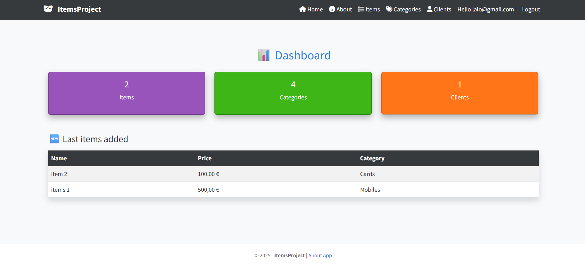

# itemsproject

# ItemsProject

Projet ASP.NET Core MVC + Entity Framework Core.

## Objectif
Application de gestion d'articles, de catégories et de clients.

## Technologies
- ASP.NET Core 8.0
- Entity Framework Core
- SQL Server 
- Bootstrap 5

## Fonctionnalités
- CRUD complet (Items, Categories, Clients)
- Upload d’images
- Relation many-to-many (Items ↔ Clients)
- Interface responsive

